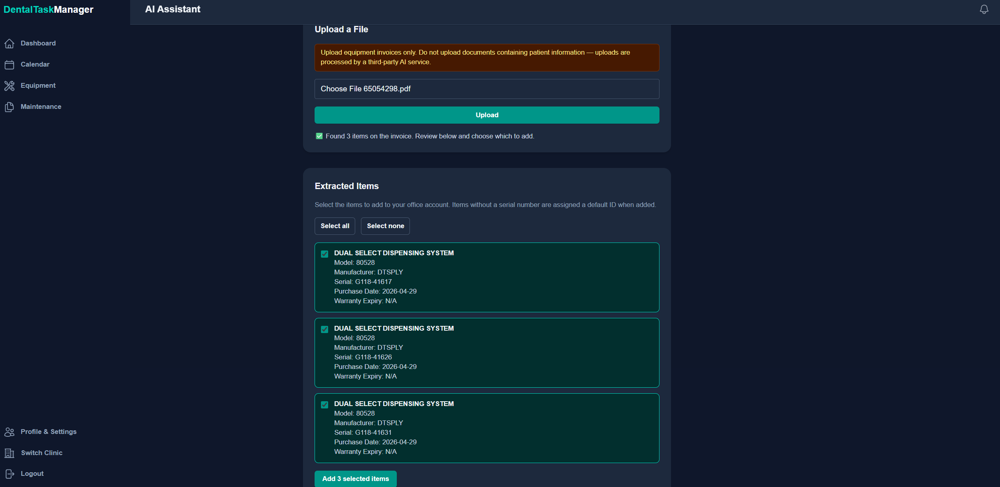
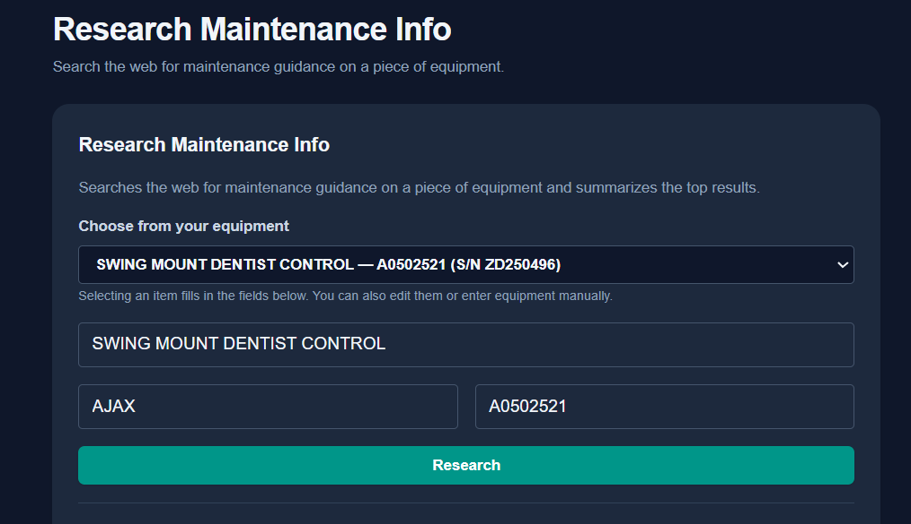
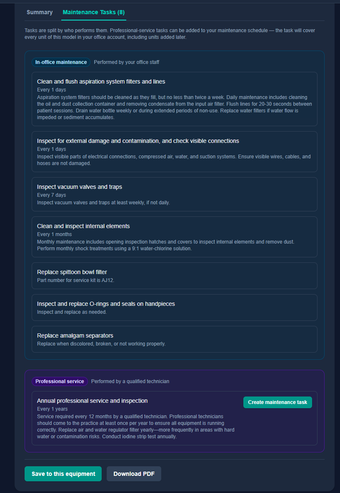
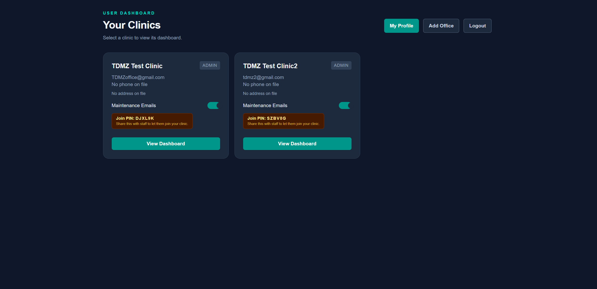

NOTE: This was a capstone project developed in to an LLC. A lot of this process was me and my partner learning many new things. What we focused on the least, is the graphic design side of things. We focused more on achieving correct and scalable functionality. UI seen below is subject to change before beta testing is complete.

# Dental Task Manager

A SaaS platform that helps dental offices track equipment and stay on top of preventative maintenance — built with a single partner, end to end, from product design to production deployment.

Dental practices run expensive, safety-critical equipment (autoclaves, X-ray units, handpieces) on manufacturer-mandated maintenance schedules. Missed maintenance risks equipment failure, compliance issues, and patient safety. This app replaces spreadsheets and tribal knowledge with a single source of truth for what needs servicing, when, and what's already been done.

## Key Features

### Smart equipment onboarding
Upload a vendor invoice PDF and the app automatically extracts equipment line items — name, model, manufacturer, serial number, purchase date, warranty — and then allows the user to choose which pieces to add to their inventory. No manual data entry, and re-uploading the same invoice won't create duplicates.

### Maintenance scheduling
Set up recurring maintenance requirements once — either for a type of equipment across every office, or for one specific machine — and the app generates scheduled maintenance events automatically.

### Maintenance history you can trust
Every completed maintenance visit is logged permanently. History stays accurate even if a schedule changes later, so offices always have a reliable audit trail for compliance and warranty purposes.

### AI-assisted maintenance research
For equipment without a documented schedule, a built-in research assistant searches the web and summarizes manufacturer maintenance guidance — recommended intervals, key tasks, parts, and safety notes. The assistant will delegate the tasks between in-office vs professional services, then serve the user a list of tasks they can select from to save to that office as recorded maintenance tasks.

Users can also view, and save, a separate summary section. This describes the maintenance tasks in more detail, along with providing sources for the information.

### Automated reminders
Offices get email notifications ahead of upcoming maintenance, so nothing falls through the cracks even when nobody's watching the dashboard.

### Multi-office, role-based access
Each dental office is its own secure workspace. Staff join with a rotating office code, and access is scoped so one office never sees another's data.

## Tech Stack

- **Frontend:** Next.js (App Router), React, TypeScript, Tailwind CSS 
- **Backend:** Next.js Server Actions, MySQL (AWS RDS)
- **Auth:** Clerk, with organizations mapped to dental offices
- **AI:** LLM-powered document extraction and web research, with validated, guarded model output
- **Email:** AWS SES
- **Deployment:** Vercel, with a containerized path to AWS

## Engineering Highlights

- **Reliable AI extraction** — invoice data pulled by the LLM is schema-validated before it ever reaches the database, so malformed or unexpected PDF content degrades gracefully instead of corrupting records.
- **Thoughtful data modeling** — equipment is modeled at both a general "definition" level and a specific physical "instance" level, so maintenance rules can apply broadly (to every unit of a model) or narrowly (to one machine at one office) — matching how dental offices actually manage their equipment.
- **Resilient by design** — maintenance detection and email delivery are decoupled, so a slow or failed email provider never blocks scheduling; email delivery itself is provider-swappable.
- **Production-tested** — deployed and iterated against real serverless deployment constraints, with fixes driven by actual production issues rather than assumptions.

---
